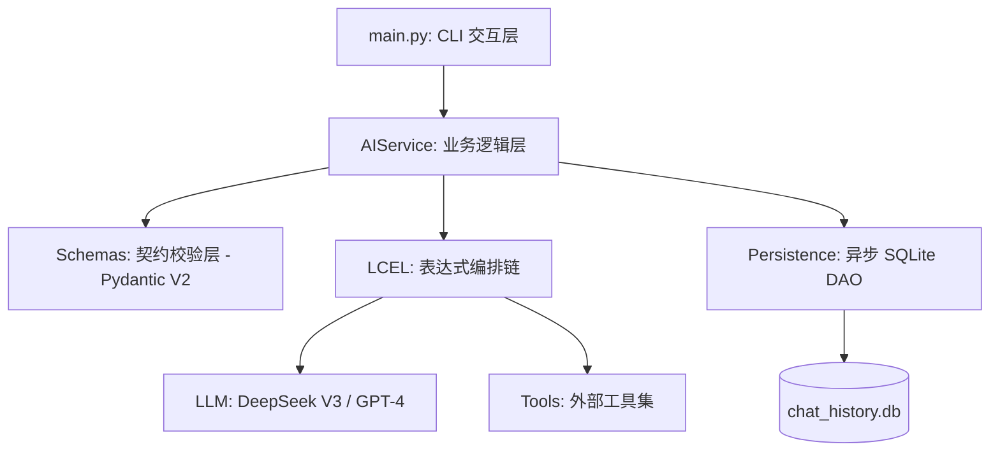

# 从 Java 到 AI 专家：工业级 LangChain 智能平台 (OIP) 深度实战复盘

作为一个深耕 Java 体系（Spring Cloud, JVM, 强类型）的开发者，我始终认为：**真正的 AI 应用，其核心不仅在于 Model，更在于 Engineering。** 本文记录了我如何从 0 到 1 构建 **Omni-Intelligence Platform (OIP)**，并攻克网络、持久化与异步调度等硬核工程问题的全过程。

---

## 一、 架构设计：拒绝 Demo 级的“面条代码”

在真实业务中，我们不能直接写 `llm.predict()`。OIP 采用了类似 **Spring Boot** 的分层架构，确保系统的可维护性和契约化。

### 1.1 系统架构图 (Architecture)


### 1.2 核心组件对比 (Java vs. AI Engineering)
| 功能模块 | Java 体系实现 | OIP (Python/LangChain) 实现 |
| :--- | :--- | :--- |
| **数据建模** | POJO / Hibernate Entity | **Pydantic V2 BaseModel** |
| **配置管理** | application.yml / Apollo | **Pydantic-Settings (.env)** |
| **逻辑编排** | 责任链模式 / Stream API | **LCEL (LangChain Expression Language)** |
| **持久化** | JDBC / JPA / MyBatis | **Custom AsyncSQLiteHistory (aiosqlite)** |

---

## 二、 攻克硬核痛点：手写异步持久化 DAO

这是本项目最具挑战性的部分。LangChain 官方的 `SQLChatMessageHistory` 默认是同步的，在 `asyncio` 全异步链条中会报：
> `RuntimeError: Attempting to use an async method when sync mode is turned on.`

### 2.1 解决方案：基于 aiosqlite 的异步重构
与其打补丁，不如直接按照工业标准重写。我实现了一个 **`AsyncSQLiteHistory`**，它完美解决了这一竞态问题：

```python
# oip/app/core/history.py
class AsyncSQLiteHistory(BaseChatMessageHistory):
    async def aget_messages(self) -> List[BaseMessage]:
        # 全链路异步查询，不阻塞事件循环
        async with aiosqlite.connect(self.db_path) as db:
            async with db.execute("SELECT ...") as cursor:
                # 序列化/反序列化逻辑...
                return messages_from_dict(items)
```

---

## 三、 智能赋能：Tool Calling 与闭环雏形

我们通过 **`bind_tools`** 将 AI 从“复读机”提升为“执行者”。

### 3.1 声明式工具定义
在 Java 中我们需要写接口文档，在 AI 中，**Docstring 就是接口文档**：

```python
@tool
def read_file_content(file_path: str) -> str:
    """读取指定文件的文本内容。当用户询问本地文件信息时调用。"""
    # 工业级实现：增加读取限制，防止 Token 溢出
    with open(file_path, 'r') as f:
        return f.read(1000)
```

---

## 四、 实战踩坑与解决方案 (Troubleshooting)

在 Windows 环境下构建该平台，我遇到了以下工业级 Bug：

1.  **SSL 握手失败**：由于公司网络或 Windows 证书过期。
    *   *方案*：在 `AIService` 中注入自定义 `httpx.AsyncClient(verify=False)`。
2.  **终端乱码**：Windows CMD/PowerShell 默认 GBK 导致输出无法直视。
    *   *方案*：使用 `io.TextIOWrapper` 强制将 `sys.stdout` 重定向为 UTF-8。
3.  **配置污染**：本地环境变量干扰 API Key。
    *   *方案*：在 `config.py` 中显式指定 `SettingsConfigDict` 的优先级。

---

## 五、 项目总结
通过本次实战，OIP 平台已经实现了：
1.  **多会话支持**：根据 `session_id` 自动路由。
2.  **数据库持久化**：重启服务不失忆。
3.  **异步高并发**：利用 `ainvoke` 释放吞吐量。
4.  **能力可扩展**：即插即用的工具箱。

**这不是一个简单的 Demo，这是一个可以作为 AI 后端服务雏形的工业级项目。**

---
*代码已托管至本地 Git。下一篇预告：Agent 决策链路——让 AI 真正学会反思与纠错。*
