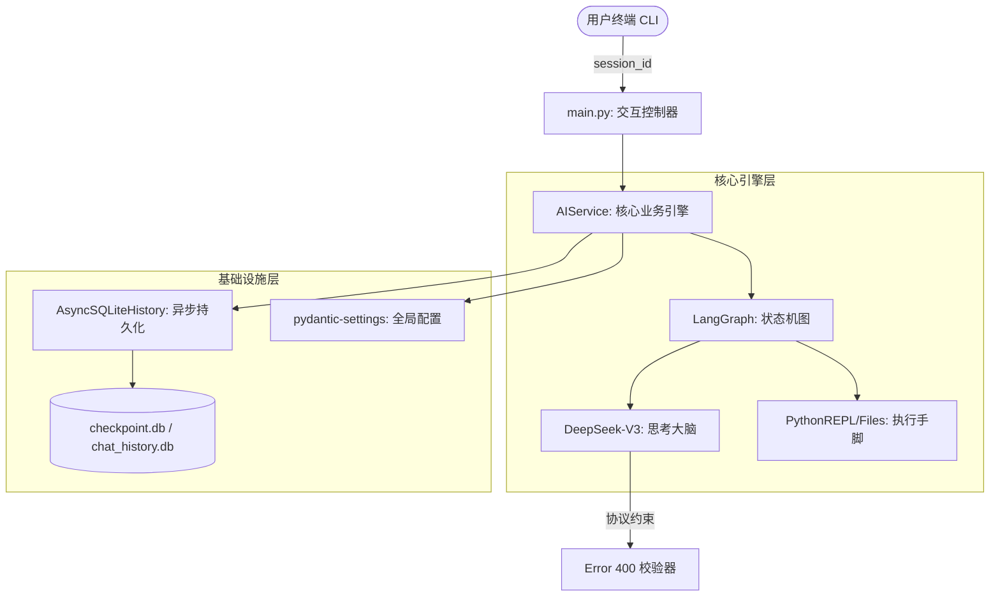

# Omni-Intelligence Platform (OIP) - 工业级 LangChain 实战全记录

本项目是一个基于 **Python 异步架构**、**LangChain** 与 **LangGraph** 驱动的生产级 AI 智能体平台。它不仅是一个聊天机器人，更是一个具备**长效数据库记忆**、**自动化工具执行**及**自我纠错能力**的智能系统。

---

## 🗺️ 1个月 AI 专家成长路线图 (Roadmap)
*针对 Java 高手量身定制，利用工程化思维降维打击 AI 开发。*

### 第一阶段：工程骨架与核心架构 (已完成 ✅)
- [x] **模块 01：Python 工程化补齐**：Pydantic V2 建模、Async/Await 异步调度。
- [x] **模块 02：持久化记忆 (Memory)**：手写异步 SQLite DAO，解决全链路异步冲突。
- [x] **模块 03：工具调用 (Tool Calling)**：LLM 消息时序协议、自动执行 Python REPL。
- [x] **模块 04：LangGraph 状态机**：构建自修复智能体，实现 Agent 决策闭环。

### 第二阶段：知识增强与多体协作 (进行中 🚀)
- [ ] **模块 05：企业级 RAG 系统 [待开始]**：集成 Chroma 向量数据库，攻克语义检索与 Rerank。
- [ ] **模块 06：多智能体 (Multi-Agent) 协同 [待开始]**：
    - **核心技术**：主从架构 (Router)、任务分发。
    - **进阶挑战**：**多 Agent 记忆协同**（如何让程序员 Agent 共享架构师 Agent 的上下文）。
- [ ] **模块 07：Agent 情感与拟人化 [待开始]**：
    - **核心技术**：System Prompt 调优、情感状态检测。
    - **进阶挑战**：构建带“脾气”和“性格”的 AI 助手。

### 第三阶段：生产落地与性能评估 (即将到来 🏁)
- [ ] **模块 08：可观测性 (Observability)**：集成 LangSmith 进行全链路 Trace 监控。
- [ ] **模块 09：RAG 评估框架 (Ragas)**：量化 AI 的幻觉率与回答准确度。
- [ ] **模块 10：面试冲刺与系统设计**：简历包装、百万级并发 AI 架构设计。

---

## 🏗️ 核心架构演进 (Architecture)

### 系统架构图

---

## 🛠️ 已完成模块深度解析

### 1. 深度持久化——手写异步 SQLite DAO
**痛点：** 官方 `SQLChatMessageHistory` 底层是同步的。在一个纯异步的 AI 链路（`ainvoke`）中，同步数据库操作会阻塞事件循环并触发 `RuntimeError`。
**方案：** 引入 `aiosqlite`，手写继承自 `BaseChatMessageHistory` 的异步类，实现了真正非阻塞的数据库读写。

### 2. LangGraph 自修复循环 (Self-Correction)
**逻辑：** 如果 AI 写的代码报错，系统会捕捉 Traceback 喂回给 `agent` 节点。AI 会在下一次循环中自动修正代码，直到获得结果。
**隐喻：** 对标 Java 的事务检查点与 TDD 循环。

---

## 📈 Java 程序员技术对标
| 模块 | Java 生态对标 | 本项目意义 |
| :--- | :--- | :--- |
| **Pydantic** | Hibernate / JSR303 | 数据契约安全 |
| **LCEL** | Java Stream / 责任链 | 逻辑声明式编排 |
| **AsyncIO** | Netty / Loom | 高并发不阻塞 |
| **LangGraph** | Activiti / Flowable | 行为可控的状态机 |

---

## 🚀 快速启动
1.  **准备环境**：`pip install langchain langchain-openai langgraph aiosqlite pydantic-settings`
2.  **配置环境**：在根目录创建 `.env` 并填入 `OPENAI_API_KEY`。
3.  **运行程序**：`python oip/main.py`

---
*本手册由实战经验凝练而成，明天我们将开启模块 05：RAG 知识库，让 AI 拥有属于它自己的“私人图书馆”。*
